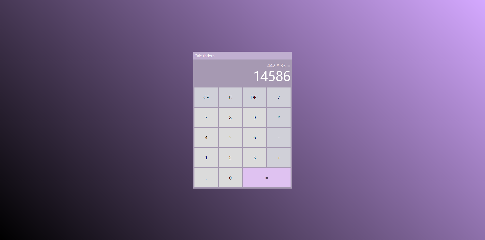

# Calculadora

Este projeto foi criado com o [Angular CLI](https://github.com/angular/angular-cli) versão 18.1.0.

## Funcionalidades:

- Adição;
- Subtração;
- Multiplicação;
- Divisão;
- DEL "Delete" - Apaga o ultimo dígito;
- CE "Cancel Entry" - Cancela o registro;
- C "Clear" - Limpa tudo.
